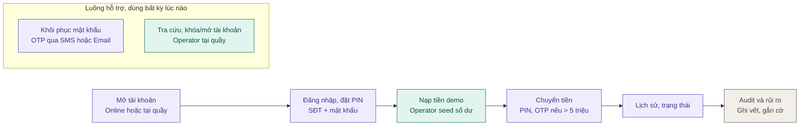
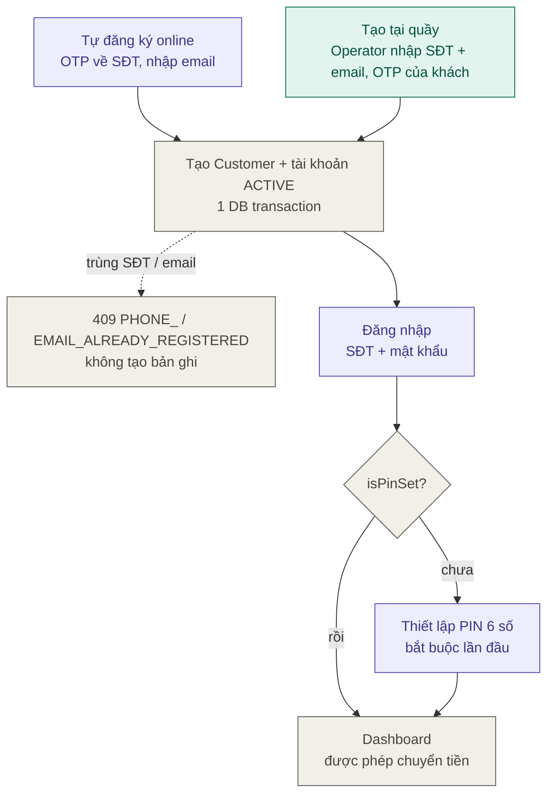
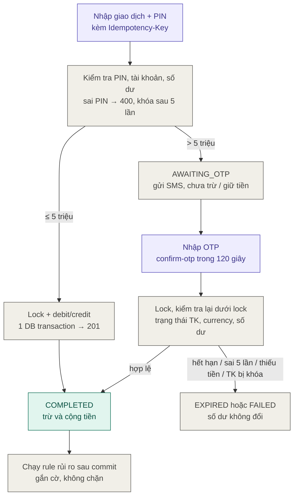
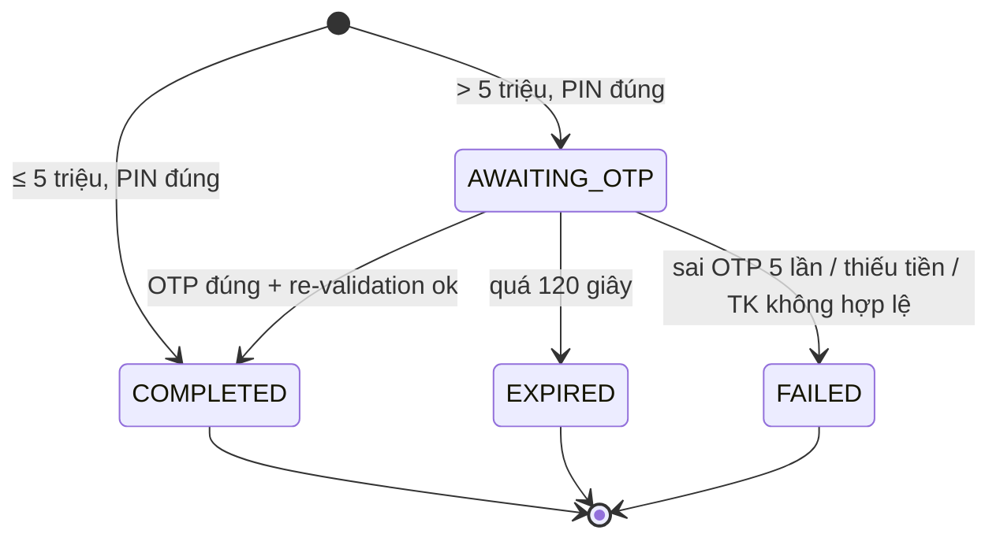
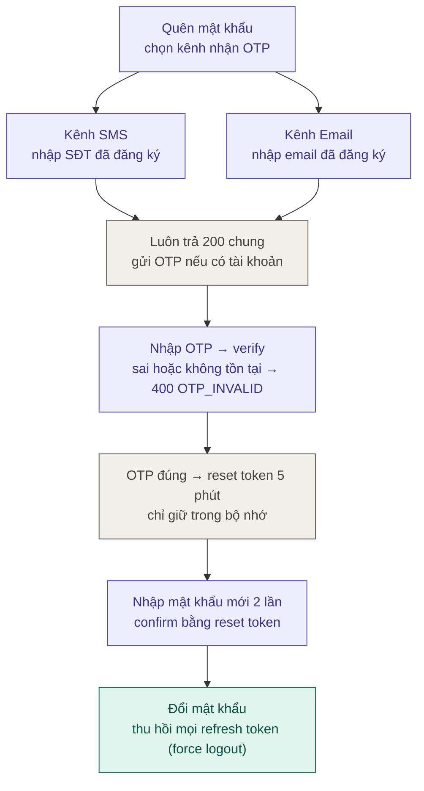
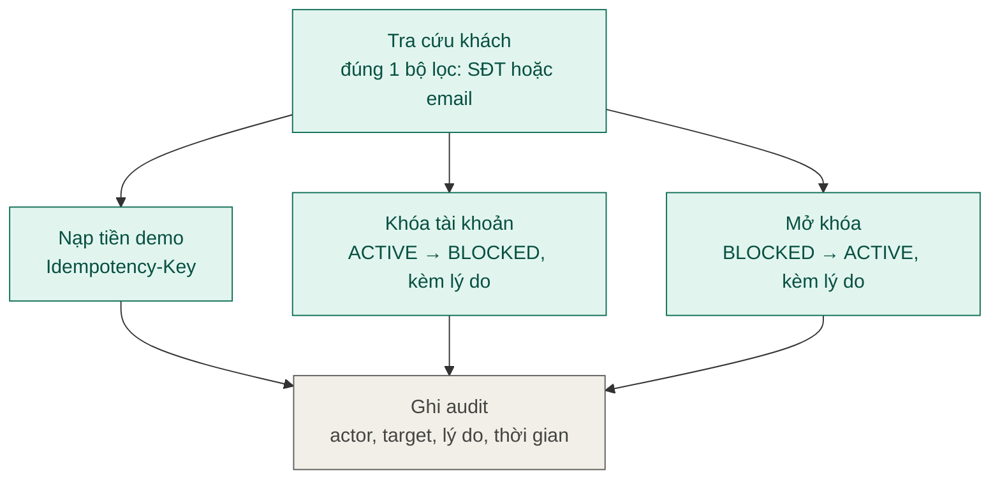
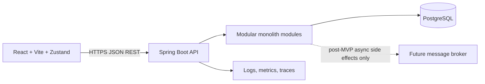

# MVP Requirements & Architecture

## 1. Goal and context

Xây Digital Banking Simulator hướng production-oriented MVP để mô phỏng nghiệp vụ tài khoản và chuyển tiền nội bộ. Hệ thống phục vụ mục tiêu học Cloud Application Development, không xử lý tiền thật và không kết nối ngân hàng, payment gateway hoặc core banking.

MVP phải chứng minh một business flow đầu-cuối chạy được, có security, consistency, failure handling, observability, cloud deployment và các quyết định kiến trúc có thể giải thích bằng workload/NFR.

## 2. Scope

### In scope

- Customer tự đăng ký bằng SĐT (xác thực OTP SMS) + email; tài khoản mặc định được mở `ACTIVE` ngay.
- Operator tạo tài khoản hộ khách tại quầy (OTP gửi về SĐT của khách, nhập đủ SĐT + email).
- Customer đăng nhập bằng SĐT + mật khẩu; bắt buộc thiết lập PIN giao dịch 6 số ở lần đăng nhập đầu tiên.
- Customer khôi phục mật khẩu qua OTP, chọn 1 trong 2 kênh: SMS (SĐT) hoặc Email.
- Operator tra cứu chính xác khách hàng theo SĐT hoặc email (không có danh sách), cấp seed balance, khóa/mở tài khoản (`ACTIVE ⇄ BLOCKED`).
- Customer xem hồ sơ, tài khoản và số dư của chính mình.
- Customer chuyển tiền giữa hai tài khoản nội bộ đang hoạt động; xác thực bằng PIN, thêm OTP SMS khi số tiền > `5,000,000` VNĐ.
- Customer xem lịch sử và trạng thái giao dịch.
- Auditor/Admin tra cứu audit trail theo quyền được cấp.
- Hệ thống gắn cờ giao dịch đáng ngờ theo rule-based criteria; người có quyền xem cờ và lý do.
- Idempotency cho transfer, consistency cho debit/credit, concurrency test và failure/recovery demo.
- Load test có latency/error metrics; deploy cloud, CI/CD, health/metrics/logging.

### Out of scope

- Tiền thật, external bank rails, card processing, payment gateway hoặc regulatory compliance thật.
- Nạp/rút tiền do Customer khởi tạo.
- Nhiều tài khoản cho một Customer trong MVP.
- FX, interest, loans, bills, scheduled transfers, joint accounts.
- ML fraud model. MVP chỉ dùng deterministic rules; ML chỉ được xem xét sau khi có dataset/evaluation.
- Microservices, service mesh, Kubernetes bắt buộc, multi-region active-active.
- Full notification delivery (thông báo biến động số dư, marketing). Chỉ gửi OTP qua interface `OtpSender`; MVP dùng adapter giả lập (log/mailbox local, không commit mã thật) và có thể thay bằng SMS/Email provider thật sau. Việc gửi OTP thật qua nhà mạng không phải acceptance gate.
- Mobile app.

## 3. Users and permissions

| Actor | Quyền chính |
|---|---|
| Customer | Đăng ký (SĐT + email + OTP)/đăng nhập (SĐT + mật khẩu); khôi phục mật khẩu; thiết lập/đổi/quên PIN; xem hồ sơ, tài khoản, số dư và giao dịch của mình; tạo transfer từ tài khoản thuộc mình; không được đọc hoặc thao tác dữ liệu Customer khác. |
| Operator | Tạo Customer + tài khoản mặc định tại quầy (có OTP của khách); tra cứu chính xác khách theo SĐT/email; cấp seed balance; khóa/mở tài khoản. Không được biết hoặc đặt PIN của khách. Mọi mutation phải được audit. |
| Auditor | Read-only tra cứu giao dịch, audit records và suspicious flags theo phạm vi quyền được định nghĩa. Không được mutate số dư hoặc hồ sơ. |
| Admin | Quản trị user/role và hỗ trợ truy vấn. Không được bypass business transaction rules; mọi hành động đặc quyền phải audit. |

Least privilege là mặc định. Role không thay thế ownership check: Customer chỉ được truy cập resource thuộc chính Customer đó.

## 4. Functional requirements

### FR-01 Self-service registration (phone OTP)

- Định danh: `phone` (bắt buộc, SĐT Việt Nam 10 số `^0[3-9][0-9]{8}$`, UNIQUE) là định danh đăng nhập chính; `email` (bắt buộc, UNIQUE) là định danh thứ hai dùng cho kênh khôi phục. Hai định danh song song, không thay thế nhau.
- Input: `phone`, `email`, `password`, `fullName`, `otp`; `address` tùy chọn. Các trường này không cấu thành identity verification hay regulatory KYC.
- Luồng: `POST /auth/register/send-otp` gửi OTP 6 số (TTL 120 giây) về SĐT → `POST /auth/register` kèm OTP. OTP sai/hết hạn/đã dùng → `400 OTP_INVALID`.
- Backend validate input, lưu password hash an toàn, tạo Customer và đúng một tài khoản mặc định `ACTIVE` trong cùng một DB transaction.
- Trùng SĐT → `409 PHONE_ALREADY_REGISTERED`; trùng email → `409 EMAIL_ALREADY_REGISTERED`; không tạo bản ghi thứ hai (đảm bảo bằng DB unique constraint, không chỉ kiểm tra ở application).
- Registration không tự đăng nhập; FE chuyển sang màn Login.

### FR-02 Operator counter customer creation

- Operator nhập thông tin khách tại quầy: `phone`, `email` (cả hai bắt buộc, UNIQUE như FR-01), `fullName`, `initialPassword`, `address` tùy chọn.
- `POST /operator/customers/send-otp` gửi OTP về SĐT khách đang có mặt; khách đọc OTP cho Operator → `POST /operator/customers`.
- Tạo Customer + một tài khoản mặc định `ACTIVE` phải atomic. Request lặp/trùng định danh trả `409`, không tạo tài khoản thứ hai.
- Operator không đặt PIN cho khách; khách bắt buộc tự thiết lập PIN ở lần đăng nhập đầu. Nên khuyến nghị khách đổi mật khẩu ban đầu (qua FR-09).
- Audit ghi Operator là actor, Customer là target.
- Tra cứu khách: `GET /operator/customers?phone=` hoặc `?email=`, bắt buộc đúng một bộ lọc khớp chính xác; không có endpoint liệt kê toàn bộ khách. Mỗi lần tra cứu đều được audit và rate-limit.

### FR-02b Account status management (block/unblock)

- Operator/Admin chuyển trạng thái tài khoản `ACTIVE ⇄ BLOCKED` kèm lý do bắt buộc; `CLOSED` là trạng thái cuối, trả `409 ACCOUNT_NOT_ELIGIBLE`.
- Idempotent: khóa tài khoản đã khóa (hoặc mở tài khoản đang mở) trả `200` với trạng thái hiện tại, không mutation/audit trùng.
- Thay đổi trạng thái lấy row lock của account, nên tuần tự hóa với transfer đang chạy.
- Tài khoản `BLOCKED` không gửi/nhận transfer, không nhận seed; recipient resolve trả not-available; transfer `AWAITING_OTP` liên quan chuyển `FAILED` khi confirm. Vẫn xem được số dư và lịch sử.
- Audit ghi actor, account, trạng thái cũ/mới và lý do.

### FR-03 Demo balance initialization

- Account-creation response (FR-01/FR-02) returns the default account ID; Operator uses it to seed initial demo balance.
- Only Operator can seed a valid account.
- Record actor, amount, currency, account, timestamp and reference.
- Seed balance is simulated and clearly labeled as demo funds; no Customer deposit endpoint exists.
- Operator finds an existing customer's `accountId` via exact lookup (FR-02); broad/partial account search remains post-MVP.

### FR-04 Account and balance query

- Customer xem danh sách tài khoản của mình và balance hiện tại.
- Amount dùng decimal type chính xác, không dùng floating point; currency được lưu rõ.
- Không cho phép Customer truy cập account chỉ bằng cách đoán hoặc thay ID (chống IDOR).

### FR-05 Internal transfer

- Customer chỉ được debit tài khoản thuộc mình.
- Source và destination phải khác nhau, tồn tại, hoạt động và cùng currency.
- Customer có thể tra cứu thông tin masked của người nhận qua `POST /recipients/resolve` trước khi xác nhận chuyển tiền.
- Amount phải lớn hơn zero và nằm trong giới hạn cấu hình/validation được đặc tả ở API contract.
- Xác thực giao dịch phân tầng: mọi transfer yêu cầu PIN 6 số đúng; amount <= `5,000,000` VNĐ commit ngay (`201`); amount > `5,000,000` VNĐ trả `200 AWAITING_OTP`, gửi OTP SMS về SĐT đã đăng ký, chỉ debit/credit sau khi `POST /transfers/{transferId}/confirm-otp` hợp lệ. Trong trạng thái chờ OTP, số dư không thay đổi và không giữ chỗ (reserve) tiền.
- Step-up state machine: `AWAITING_OTP → COMPLETED | EXPIRED (sau 120s) | FAILED (sai OTP 5 lần hoặc re-validation thất bại)`. Tại confirm, backend lock account rows và **kiểm tra lại** trạng thái, currency và số dư dưới lock trước khi debit/credit.
- Idempotency cho step-up: replay `POST /transfers` cùng key/payload trả trạng thái hiện tại của cùng giao dịch (không gửi OTP mới); confirm idempotent theo `transferId` — gọi lại sau `COMPLETED` trả kết quả cũ, không trừ tiền lần hai.
- Backend thực hiện debit, credit, transaction record và audit facts trong atomic DB transaction.
- Thiếu số dư, tài khoản bị khóa, input sai hoặc currency không khớp phải từ chối mà không đổi balance.
- API trả transaction ID và status. Client timeout không được xem là bằng chứng transfer thất bại; client phải tra cứu bằng idempotency key/transaction ID.

### FR-06 Transaction history and status

- Customer chỉ đọc transfer mà mình là chủ thể của source hoặc destination account.
- Kết quả hỗ trợ pagination ổn định và filter cơ bản theo status/date range nếu nằm trong release scope.
- Trả về thông tin masked và limited display name người đối ứng (`counterpartyDisplayName`) để giao diện hiển thị rõ ràng. Không trả email, phone hoặc address.
- Status và timestamp phản ánh state đã commit; không hiển thị trạng thái thành công trước commit.
- Trạng thái giao dịch: `AWAITING_OTP`, `COMPLETED`, `EXPIRED`, `FAILED` (kèm `failureCode`). `GET /transfers/{transferId}` trả trạng thái hiện tại để FE đối soát sau timeout; history lọc được theo `status`.
- Chủ tài khoản nguồn thấy mọi trạng thái; chủ tài khoản đích chỉ thấy giao dịch `COMPLETED`. Trạng thái cuối (`COMPLETED`, `EXPIRED`, `FAILED`) không bao giờ thay đổi.

### FR-07 Audit trail

- Ghi actor, action, target, timestamp, outcome, correlation ID và metadata cần thiết.
- Ghi audit cho login outcome phù hợp, registration/counter creation, account creation, seed balance, transfer, PIN setup/change/reset, password recovery (initiate/verify/confirm) và thay đổi quyền/trạng thái.
- Audit trail không chứa password, PIN, OTP, token, secret hoặc toàn bộ payload nhạy cảm.
- Customer không thể sửa hoặc xóa audit record qua API.

### FR-08 Suspicious transaction flags

- Áp dụng rule-based checks lên transfer đã được tiếp nhận theo định nghĩa rõ: ví dụ vượt ngưỡng amount (large transfer > 5,000,000 VNĐ), tần suất cao trong cửa sổ thời gian (> 5 transfer / 10 phút).
- Rule configuration, thresholds and windows are environment-configurable; document effective non-secret values. Store rule ID/version with each flag.
- Flag stores transfer reference, rule ID/version, reason and detection time. Operator/Auditor/Admin can list flags. Review workflow and `REVIEWED` status are post-MVP options.
- Flagging không tự ý đổi transfer outcome trong MVP (chỉ đóng vai trò cảnh báo kiểm toán).

### FR-09 Account recovery (forgot password, 2 OTP channels)

- Người dùng bấm "Quên mật khẩu" và chọn kênh nhận OTP: `SMS` (nhập SĐT đã đăng ký) hoặc `EMAIL` (nhập email đã đăng ký).
- Bước 1 `POST /auth/recover/initiate`: hệ thống gửi OTP 6 số (TTL 120 giây) tới đúng kênh đã chọn. Identifier phải khớp loại kênh.
- Bước 2 `POST /auth/recover/verify`: người dùng nhập OTP. OTP dùng một lần, gắn với `identifier + channel + purpose`, sai 5 lần bị vô hiệu. OTP hợp lệ trả reset token ngẫu nhiên, dùng một lần, TTL 5 phút; FE chỉ giữ trong bộ nhớ.
- Bước 3 `POST /auth/recover/confirm`: FE gửi reset token và mật khẩu mới (trên giao diện nhập/xác nhận 2 lần). API không còn nhận OTP cùng mật khẩu. Reset token sai, hết hạn hoặc đã dùng trả `400 RECOVERY_TOKEN_INVALID`.
- Yêu cầu OTP mới vô hiệu OTP và reset token cũ. `/verify` giới hạn riêng bucket IP và identifier, mỗi bucket 5 lần/300 giây; hết một bucket là từ chối.
- Khi thành công: lưu password hash mới và **thu hồi toàn bộ refresh token** của user (force logout mọi thiết bị) trong cùng transaction. Đây là yêu cầu bắt buộc cho mọi sự kiện đổi mật khẩu.
- Initiate bị rate-limit theo identifier và IP. Audit ghi các bước recovery có user tương ứng, không ghi OTP, reset token hoặc mật khẩu.
- Chống dò tài khoản (anti-enumeration): initiate **luôn trả `200` với cùng nội dung** dù identifier có đăng ký hay không; verify với identifier không tồn tại trả `400 OTP_INVALID`, giống OTP sai. Không trả `404`. Cần kiểm thử thêm chênh lệch thời gian phản hồi giữa tài khoản có/không có trước nghiệm thu bảo mật.
- Rủi ro chấp nhận (accepted risk): luồng đăng ký vẫn trả `409 PHONE_ALREADY_REGISTERED` / `EMAIL_ALREADY_REGISTERED` để UX rõ ràng; giảm thiểu bằng rate limit chặt trên `send-otp` và yêu cầu OTP hợp lệ trước khi submit.

### FR-10 Transaction PIN management

- Sau đăng nhập, nếu `isPinSet = false`, FE bắt buộc chuyển tới màn thiết lập PIN; BE từ chối transfer khi chưa có PIN.
- PIN 6 số được lưu dạng hash (không lưu plaintext), tách biệt với password.
- Đổi PIN cần PIN hiện tại; quên PIN dùng OTP gửi về SĐT đã đăng ký.
- Sai PIN 5 lần liên tiếp → khóa PIN 15 phút (`403 PIN_LOCKED`).

### Business flows

Sơ đồ dưới đây minh họa các FR ở trên; chi tiết request/response và mã lỗi nằm trong [API & Team Contract](./api-and-team-contract.md) và `../../contracts/openapi.yaml`. Màu: tím = Customer, xanh = Operator, xám = hệ thống.

#### BF-1 Tổng quan vòng đời



#### BF-2 Mở tài khoản và đăng nhập lần đầu (FR-01, FR-02, FR-10)



#### BF-3 Chuyển tiền xác thực phân tầng (FR-05, FR-06, FR-08)



Trạng thái giao dịch (`TransferStatus`):



Chỉ `COMPLETED` làm thay đổi số dư. Replay `POST /transfers` cùng key trả trạng thái hiện tại (không gửi OTP mới); gọi lại `confirm-otp` sau `COMPLETED` trả kết quả cũ, không trừ tiền lần hai.

#### BF-4 Khôi phục mật khẩu qua 2 kênh (FR-09)



#### BF-5 Nghiệp vụ Operator tại quầy (FR-02, FR-02b, FR-03)



## 5. Architecture

### 5.1 System shape



Backend là một Spring Boot deployable, chia module theo business capability. MVP dùng một PostgreSQL database, nhưng từng module sở hữu bảng và nghiệp vụ của mình. Không tạo cross-module repository access hoặc database foreign key dependency như đường giao tiếp nội bộ.

Frontend build/deploy độc lập. Browser chỉ giao tiếp với public REST API qua OpenAPI contract. FE không truy cập database, không nhúng business rule có thẩm quyền và không giữ secret.

### 5.2 Backend module boundaries

| Module | Ownership và trách nhiệm |
|---|---|
| `identity` | User credential (phone/email login identifiers, password hash, PIN hash), login, token/session revocation, role, OTP issue/verify qua `OtpSender` (SMS/Email adapter). Không sở hữu customer profile hoặc balance. |
| `customer` | Customer profile (fullName, phone, email, address), registration và counter creation use case. |
| `account` | Account lifecycle, ownership, currency, status, balance mutation primitives. Chỉ `transfer` gọi use case nội bộ được công khai qua module API. |
| `transfer` | Transfer request, idempotency record, orchestration trong một transaction, status/history, transaction references. |
| `audit` | Audit record model và query policy. Module nghiệp vụ gửi audit facts qua interface/domain event nội bộ; không viết trực tiếp vào bảng audit. |
| `risk` | Evaluate configured rules after transfer commit and expose read-only flags. No review workflow in MVP. |
| `shared` | Chỉ thành phần kỹ thuật dùng chung thật sự như error envelope, clock abstraction, request correlation. Không đặt domain entity chung hoặc gom business logic. |

Các tên module là baseline. Có thể gộp `identity` vào module khác nếu implementation nhỏ, nhưng ownership và public contract vẫn phải rõ.

### 5.3 Module dependency rules

- Module public API/use case là điểm giao tiếp duy nhất.
- Modules communicate through internal application APIs; no cross-module repository access or database joins in business paths.
- Không tạo vòng phụ thuộc.
- Business transaction không gọi network hoặc broker bên trong DB transaction.
- Audit facts are written through internal application APIs in the same DB transaction as money mutations. No network calls or broker publish occur in the transaction.
- OpenAPI mô tả public HTTP contract; interface Java nội bộ không thay thế OpenAPI.

### 5.4 Money transfer consistency boundary

Vì account và transfer nằm trong cùng modular monolith và cùng PostgreSQL database, transfer phải xử lý trong một DB transaction duy nhất. Không dùng distributed Saga cho MVP transfer nội bộ.

1. Xác thực actor và kiểm tra ownership.
2. Kiểm tra idempotency key và payload hash.
3. Lock source/destination account rows theo thứ tự ID ổn định.
4. Validate status, currency, amount, limits và available balance dưới lock.
5. Ghi debit/credit, immutable transfer record, idempotency result và audit facts.
6. Commit một lần; chỉ sau commit mới trả success.
7. Với lỗi trước commit, rollback mọi mutation.

Với transfer > 5,000,000 VNĐ, bước 1–2 và kiểm tra PIN diễn ra ở `POST /transfers` (chỉ tạo bản ghi `AWAITING_OTP`, không động vào số dư). Bước 3–7 diễn ra ở `confirm-otp` sau khi OTP hợp lệ: lock, re-validate dưới lock, debit/credit và chuyển `COMPLETED` trong **một** DB transaction. Không có khoảng thời gian nào tiền đã trừ mà chưa cộng.

Nếu dùng optimistic conflict/retry, retry policy phải giới hạn và không được lặp side effect. Pessimistic row lock là baseline MVP vì yêu cầu demo concurrent transfer/withdrawal và tránh overdraft.

### 5.5 Data ownership baseline

| Data | Owner |
|---|---|
| Login identity (UNIQUE phone, UNIQUE email), password hash, PIN hash, role, refresh sessions, OTP challenges | `identity` |
| Customer profile | `customer` |
| Account, current balance, account status | `account` |
| Transfer record, idempotency key/hash/result | `transfer` |
| Audit records | `audit` |
| Risk rule result/flag | `risk` |

ID tham chiếu giữa module được lưu như scalar identifier. Không query xuyên module bằng join trong business path. API/application use case lấy dữ liệu cần thiết qua module boundary.

Balance là current-state projection để query nhanh. Transfer/account mutation history phải giữ đủ immutable financial records để kiểm toán và đối soát demo. Không sửa/xóa lịch sử tài chính bằng endpoint thông thường.

## 5.6 Future evolution path to microservices (post-MVP)

This section is a roadmap only. None of these components or patterns are MVP implementation or acceptance requirements.

1. **Preserve module boundaries:** Start with module-owned tables/schemas in the existing PostgreSQL database. Consider separate databases only when operational, security or scaling evidence justifies the added complexity.
2. **Choose consistency model deliberately:** A service split removes one local ACID transaction boundary. Saga with idempotent commands, durable state, timeouts, retries, compensation and reconciliation is a future option only when the business accepts temporary inconsistency. It does not provide the same atomic guarantee as the MVP database transaction.
3. **Add reliable event delivery only when needed:** If future asynchronous consumers are introduced, evaluate Transactional Outbox with a real dispatcher/CDC path, retries, monitoring and retention. MVP does not create an outbox table, run Kafka or route balance decisions through a broker.


## 6. Repository structure

```text
Cloud/
├── backend/
│   ├── pom.xml
│   ├── Dockerfile
│   └── src/
│       ├── main/
│       │   ├── java/<base-package>/
│       │   │   ├── identity/
│       │   │   │   ├── api/
│       │   │   │   ├── application/
│       │   │   │   ├── domain/
│       │   │   │   └── infrastructure/
│       │   │   ├── customer/
│       │   │   ├── account/
│       │   │   ├── transfer/
│       │   │   ├── audit/
│       │   │   ├── risk/
│       │   │   └── shared/
│       │   └── resources/
│       │       ├── application.yml
│       │       └── db/migration/
│       └── test/java/<base-package>/
│           ├── identity/
│           ├── customer/
│           ├── account/
│           ├── transfer/
│           ├── audit/
│           └── risk/
├── frontend/
│   ├── package.json
│   ├── vite.config.ts
│   └── src/
│       ├── app/
│       ├── features/
│       │   ├── auth/
│       │   ├── onboarding/
│       │   ├── accounts/
│       │   ├── transfers/
│       │   ├── operations/
│       │   └── audit/
│       ├── shared/
│       ├── api/
│       └── stores/
├── contracts/
│   └── openapi.yaml
├── infra/
│   ├── compose.yaml
│   ├── env.example
│   └── cloud/
├── tests/
│   ├── load/
│   └── e2e/
└── docs/
```

Implementation may use Java package modules in one Maven application. Do not create separate Maven deployables per module in MVP. Frontend feature folders own screen-level components and client state. `api/` owns HTTP client and generated/handwritten contract types. `stores/` owns Zustand client/UI state only; server data must have an explicit fetch/cache/invalidation policy and must not become a second source of truth.

## 7. Delivery phases

1. **Contract baseline**: approve roles, state transitions, amount/currency rules, endpoints and OpenAPI schemas.
2. **Backend foundation**: Spring Boot app, PostgreSQL, migrations, auth, error envelope, health endpoint and module boundaries.
3. **Onboarding vertical slice**: phone-OTP registration, Operator counter creation, atomic account creation, login by phone, PIN setup, account recovery (SMS/Email), FE Operator/customer flows.
4. **Money vertical slice**: seed balance, account query, transfer, idempotency, row locking, history/status.
5. **Audit and risk**: immutable audit queries, deterministic rule flags, authorization checks.
6. **Cloud engineering**: container build, CI/CD, deployment, dashboards/logging, load/failure/security demonstrations.

Each phase must leave a runnable, testable increment. FE and BE can work in parallel after contract baseline; contract changes require coordinated review.

## 8. Acceptance criteria

- Registration with valid phone OTP creates exactly one Customer and one `ACTIVE` default account atomically; invalid/expired OTP creates nothing.
- Duplicate phone or duplicate email (self-service or counter) returns `409` and creates no second record, including under concurrent requests.
- Login succeeds only with phone + password; email cannot be used as login identifier.
- Operator counter creation requires phone, email and customer OTP; customer must set PIN on first login.
- Transfer without valid PIN is rejected; transfer > 5,000,000 VNĐ changes no balance until OTP is confirmed.
- Step-up transfer: repeated confirm after `COMPLETED` returns same result with one debit only; confirm after 120s returns `409 TRANSFER_EXPIRED`; balance drop between PIN and OTP makes confirm fail (`FAILED`, balances unchanged).
- `GET /transfers/{id}` returns correct status for `AWAITING_OTP`, `COMPLETED`, `EXPIRED` and `FAILED` transfers.
- Operator block makes transfer from/to the account fail with `409 ACCOUNT_NOT_ELIGIBLE`; unblock restores it; repeated block is idempotent; both are audited.
- Operator customer lookup requires exactly one exact filter; unfiltered request returns `400`.
- Account recovery works via both SMS and Email channels; after success, old password fails and all previous refresh tokens are rejected.
- Recovery initiate returns identical status/body for registered and unregistered identifiers; verify with unregistered identifier returns `400 OTP_INVALID`; invalid reset token at confirm returns `400 RECOVERY_TOKEN_INVALID`.
- Operator seed balance updates only eligible account and creates traceable record.
- Customer A cannot read or transfer from Customer B account by substituting IDs.
- Valid internal transfer debits source and credits destination by identical exact decimal amount.
- Insufficient balance, invalid account, locked account, currency mismatch and self-transfer leave both balances unchanged.
- Replaying same idempotency key with same payload returns original logical result and does not move balance twice.
- Reusing same idempotency key with different payload returns conflict and performs no mutation.
- Concurrent transfers cannot overdraw an account; deterministic concurrency test proves invariant.
- Transaction history/status match committed state and support Customer ownership isolation.
- Audit records exist for customer/account creation, seed balance, transfer, PIN and password recovery events without secrets.
- Suspicious rules produce a reproducible flag with rule reference and reason.
- OpenAPI contract validates; FE can use mock responses without backend implementation.
- CI runs targeted unit/integration checks and builds FE/BE independently.
- Load-test report includes workload profile, p50/p95/p99 latency, throughput, error rate and resource/cost context.
- Cloud deployment exposes health/metrics/logs and has documented rollback path.

## 9. Assumptions requiring measurement or later decision

- **Money model:** simulated VND only, scale 0 (số nguyên); mức chuyển khoản tối thiểu `2,000` VNĐ, tối đa `10,000,000` VNĐ; seed balance tối đa `100,000,000` VNĐ (tối thiểu > 0). Configure limits server-side; see [MVP Decision Record](./mvp-decision-record.md).
- **Recipient discovery:** authenticated recipient resolution by account number with masked confirmation and rate limit.
- **Demo identities:** local `demo` profile seeds Operator/Auditor and two active Customers/accounts (with distinct phone/email and PIN already set); seed operation must be idempotent and use uncommitted local secrets.
- **Frontend remote state:** TanStack Query baseline; Zustand owns UI and session presentation state, not authoritative server data.
- Cloud provider and monthly budget remain open; portable capability-level architecture is used until team chooses provider.
- JWT access token stays in memory; rotated HttpOnly refresh cookie requires CSRF protection. Same-origin proxy is MVP deployment default.
