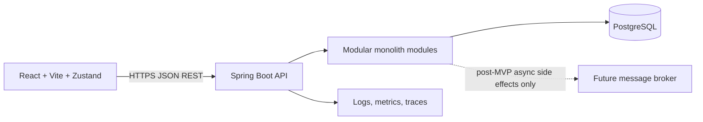

# MVP Requirements & Architecture

## 1. Goal and context

Xây Digital Banking Simulator hướng production-oriented MVP để mô phỏng nghiệp vụ tài khoản và chuyển tiền nội bộ. Hệ thống phục vụ mục tiêu học Cloud Application Development, không xử lý tiền thật và không kết nối ngân hàng, payment gateway hoặc core banking.

MVP phải chứng minh một business flow đầu-cuối chạy được, có security, consistency, failure handling, observability, cloud deployment và các quyết định kiến trúc có thể giải thích bằng workload/NFR.

## 2. Scope

### In scope

- Customer đăng ký và đăng nhập.
- Customer tạo hồ sơ ở trạng thái `PENDING`.
- Operator xem hồ sơ, duyệt hoặc từ chối hồ sơ.
- Khi duyệt, backend tạo một tài khoản mặc định thuộc Customer.
- Operator cấp seed balance trực tiếp bằng `accountId` trả về từ approval. Operational account search is a post-MVP option.
- Customer xem hồ sơ, tài khoản và số dư của chính mình.
- Customer chuyển tiền giữa hai tài khoản nội bộ đang hoạt động.
- Customer xem lịch sử và trạng thái giao dịch.
- Auditor/Admin tra cứu audit trail theo quyền được cấp.
- Hệ thống gắn cờ giao dịch đáng ngờ theo rule-based criteria; người có quyền xem cờ và lý do.
- Idempotency cho transfer, consistency cho debit/credit, concurrency test và failure/recovery demo.
- Load test có latency/error metrics; deploy cloud, CI/CD, health/metrics/logging.

### Out of scope

- Tiền thật, external bank rails, card processing, payment gateway hoặc regulatory compliance thật.
- Nạp/rút tiền do Customer khởi tạo.
- Nhiều tài khoản cho một Customer trong MVP.
- FX, interest, loans, bills, scheduled transfers, joint accounts.
- ML fraud model. MVP chỉ dùng deterministic rules; ML chỉ được xem xét sau khi có dataset/evaluation.
- Microservices, service mesh, Kubernetes bắt buộc, multi-region active-active.
- Full notification delivery. Có thể ghi nhận event/log nội bộ; email/SMS không phải acceptance gate.
- Mobile app.

## 3. Users and permissions

| Actor | Quyền chính |
|---|---|
| Customer | Đăng ký/đăng nhập; xem hồ sơ, tài khoản, số dư và giao dịch của mình; tạo transfer từ tài khoản thuộc mình; không được đọc hoặc thao tác dữ liệu Customer khác. |
| Operator | Xem hồ sơ chờ duyệt; approve/reject; tạo tài khoản mặc định khi approve; cấp seed balance; khóa/mở tài khoản nếu tính năng được đưa vào sprint scope. Mọi mutation phải được audit. |
| Auditor | Read-only tra cứu giao dịch, audit records và suspicious flags theo phạm vi quyền được định nghĩa. Không được mutate số dư hoặc hồ sơ. |
| Admin | Quản trị user/role và hỗ trợ truy vấn. Không được bypass business transaction rules; mọi hành động đặc quyền phải audit. |

Least privilege là mặc định. Role không thay thế ownership check: Customer chỉ được truy cập resource thuộc chính Customer đó.

## 4. Functional requirements

### FR-01 Registration and onboarding

- Input: login/profile data (`email`, `password`, `fullName`) and optional contact fields (`phone`, `address`) for simulator review. These fields do not constitute identity verification or regulatory KYC.
- Backend validate input, lưu credential bằng password hash an toàn và tạo Customer với status `PENDING`.
- Registration không tự mở tài khoản.
- Duplicate identity trả lỗi xác định, không tạo bản ghi thứ hai.

### FR-02 Operator review

- Operator lấy danh sách hồ sơ chờ xử lý và xem chi tiết (bao gồm thông tin liên hệ tùy chọn `phone`, `address`; đây không phải KYC verification).
- Operator có thể approve hoặc reject; chỉ hồ sơ `PENDING` được chuyển trạng thái.
- Approve và tạo một tài khoản mặc định phải atomic: hoặc cả hai commit, hoặc không thao tác nào commit.
- Reject lưu trạng thái, thời điểm, Operator và lý do phù hợp audit.
- Request lặp không tạo tài khoản thứ hai.

### FR-03 Demo balance initialization

- Approval response returns the default account ID; Operator uses it to seed initial demo balance.
- Only Operator can seed a valid account.
- Record actor, amount, currency, account, timestamp and reference.
- Seed balance is simulated and clearly labeled as demo funds; no Customer deposit endpoint exists.
- Operator account search is a post-MVP option, not implemented in MVP.

### FR-04 Account and balance query

- Customer xem danh sách tài khoản của mình và balance hiện tại.
- Amount dùng decimal type chính xác, không dùng floating point; currency được lưu rõ.
- Không cho phép Customer truy cập account chỉ bằng cách đoán hoặc thay ID (chống IDOR).

### FR-05 Internal transfer

- Customer chỉ được debit tài khoản thuộc mình.
- Source và destination phải khác nhau, tồn tại, hoạt động và cùng currency.
- Customer có thể tra cứu thông tin masked của người nhận qua `POST /recipients/resolve` trước khi xác nhận chuyển tiền.
- Amount phải lớn hơn zero và nằm trong giới hạn cấu hình/validation được đặc tả ở API contract.
- Backend thực hiện debit, credit, transaction record và audit/outbox metadata trong atomic DB transaction.
- Thiếu số dư, tài khoản bị khóa, input sai hoặc currency không khớp phải từ chối mà không đổi balance.
- API trả transaction ID và status. Client timeout không được xem là bằng chứng transfer thất bại; client phải tra cứu bằng idempotency key/transaction ID.

### FR-06 Transaction history and status

- Customer chỉ đọc transfer mà mình là chủ thể của source hoặc destination account.
- Kết quả hỗ trợ pagination ổn định và filter cơ bản theo status/date range nếu nằm trong release scope.
- Trả về thông tin masked và limited display name người đối ứng (`counterpartyDisplayName`) để giao diện hiển thị rõ ràng. Không trả email, phone hoặc address.
- Status và timestamp phản ánh state đã commit; không hiển thị trạng thái thành công trước commit.

### FR-07 Audit trail

- Ghi actor, action, target, timestamp, outcome, correlation ID và metadata cần thiết.
- Ghi audit cho login outcome phù hợp, onboarding decision, account creation, seed balance, transfer và thay đổi quyền/trạng thái.
- Audit trail không chứa password, token, secret hoặc toàn bộ payload nhạy cảm.
- Customer không thể sửa hoặc xóa audit record qua API.

### FR-08 Suspicious transaction flags

- Áp dụng rule-based checks lên transfer đã được tiếp nhận theo định nghĩa rõ: ví dụ vượt ngưỡng amount (large transfer > $5000), tần suất cao trong cửa sổ thời gian (> 5 transfer / 10 phút).
- Rule configuration, thresholds and windows are environment-configurable; document effective non-secret values. Store rule ID/version with each flag.
- Flag stores transfer reference, rule ID/version, reason and detection time. Operator/Auditor/Admin can list flags. Review workflow and `REVIEWED` status are post-MVP options.
- Flagging không tự ý đổi transfer outcome trong MVP (chỉ đóng vai trò cảnh báo kiểm toán).

## 5. Architecture

### 5.1 System shape



Backend là một Spring Boot deployable, chia module theo business capability. MVP dùng một PostgreSQL database, nhưng từng module sở hữu bảng và nghiệp vụ của mình. Không tạo cross-module repository access hoặc database foreign key dependency như đường giao tiếp nội bộ.

Frontend build/deploy độc lập. Browser chỉ giao tiếp với public REST API qua OpenAPI contract. FE không truy cập database, không nhúng business rule có thẩm quyền và không giữ secret.

### 5.2 Backend module boundaries

| Module | Ownership và trách nhiệm |
|---|---|
| `identity` | User credential, login, token/session, role. Không sở hữu customer profile hoặc balance. |
| `customer` | Customer profile, onboarding status, review decision metadata. |
| `account` | Account lifecycle, ownership, currency, status, balance mutation primitives. Chỉ `transfer` gọi use case nội bộ được công khai qua module API. |
| `transfer` | Transfer request, idempotency record, orchestration trong một transaction, status/history, transaction references. |
| `audit` | Audit record model và query policy. Module nghiệp vụ gửi audit facts qua interface/domain event nội bộ; không viết trực tiếp vào bảng audit. |
| `risk` | Evaluate configured rules after transfer commit and expose read-only flags. No review workflow in MVP. |
| `shared` | Chỉ thành phần kỹ thuật dùng chung thật sự như error envelope, clock abstraction, request correlation. Không đặt domain entity chung hoặc gom business logic. |

Các tên module là baseline. Có thể gộp `identity` vào module khác nếu implementation nhỏ, nhưng ownership và public contract vẫn phải rõ.

### 5.3 Module dependency rules

- Module public API/use case là điểm giao tiếp duy nhất.
- Modules communicate through internal application APIs; no cross-module repository access or database joins in business paths.
- Không tạo vòng phụ thuộc.
- Business transaction không gọi network hoặc broker bên trong DB transaction.
- Audit facts are written through internal application APIs in the same DB transaction as money mutations. No network calls or broker publish occur in the transaction.
- OpenAPI mô tả public HTTP contract; interface Java nội bộ không thay thế OpenAPI.

### 5.4 Money transfer consistency boundary

Vì account và transfer nằm trong cùng modular monolith và cùng PostgreSQL database, transfer phải xử lý trong một DB transaction duy nhất. Không dùng distributed Saga cho MVP transfer nội bộ.

1. Xác thực actor và kiểm tra ownership.
2. Kiểm tra idempotency key và payload hash.
3. Lock source/destination account rows theo thứ tự ID ổn định.
4. Validate status, currency, amount, limits và available balance dưới lock.
5. Ghi debit/credit, immutable transfer record, idempotency result và audit/outbox facts.
6. Commit một lần; chỉ sau commit mới trả success.
7. Với lỗi trước commit, rollback mọi mutation.

Nếu dùng optimistic conflict/retry, retry policy phải giới hạn và không được lặp side effect. Pessimistic row lock là baseline MVP vì yêu cầu demo concurrent transfer/withdrawal và tránh overdraft.

### 5.5 Data ownership baseline

| Data | Owner |
|---|---|
| Login identity, password hash, role | `identity` |
| Customer profile, onboarding state | `customer` |
| Account, current balance, account status | `account` |
| Transfer record, idempotency key/hash/result | `transfer` |
| Audit records | `audit` |
| Risk rule result/flag | `risk` |

ID tham chiếu giữa module được lưu như scalar identifier. Không query xuyên module bằng join trong business path. API/application use case lấy dữ liệu cần thiết qua module boundary.

Balance là current-state projection để query nhanh. Transfer/account mutation history phải giữ đủ immutable financial records để kiểm toán và đối soát demo. Không sửa/xóa lịch sử tài chính bằng endpoint thông thường.

## 5.6 Future evolution path to microservices (post-MVP)

This section is a roadmap only. None of these components or patterns are MVP implementation or acceptance requirements.

1. **Preserve module boundaries:** Start with module-owned tables/schemas in the existing PostgreSQL database. Consider separate databases only when operational, security or scaling evidence justifies the added complexity.
2. **Choose consistency model deliberately:** A service split removes one local ACID transaction boundary. Saga with idempotent commands, durable state, timeouts, retries, compensation and reconciliation is a future option only when the business accepts temporary inconsistency. It does not provide the same atomic guarantee as the MVP database transaction.
3. **Add reliable event delivery only when needed:** If future asynchronous consumers are introduced, evaluate Transactional Outbox with a real dispatcher/CDC path, retries, monitoring and retention. MVP does not create an outbox table, run Kafka or route balance decisions through a broker.


## 6. Repository structure

```text
Cloud/
├── backend/
│   ├── pom.xml
│   ├── Dockerfile
│   └── src/
│       ├── main/
│       │   ├── java/<base-package>/
│       │   │   ├── identity/
│       │   │   │   ├── api/
│       │   │   │   ├── application/
│       │   │   │   ├── domain/
│       │   │   │   └── infrastructure/
│       │   │   ├── customer/
│       │   │   ├── account/
│       │   │   ├── transfer/
│       │   │   ├── audit/
│       │   │   ├── risk/
│       │   │   └── shared/
│       │   └── resources/
│       │       ├── application.yml
│       │       └── db/migration/
│       └── test/java/<base-package>/
│           ├── identity/
│           ├── customer/
│           ├── account/
│           ├── transfer/
│           ├── audit/
│           └── risk/
├── frontend/
│   ├── package.json
│   ├── vite.config.ts
│   └── src/
│       ├── app/
│       ├── features/
│       │   ├── auth/
│       │   ├── onboarding/
│       │   ├── accounts/
│       │   ├── transfers/
│       │   ├── operations/
│       │   └── audit/
│       ├── shared/
│       ├── api/
│       └── stores/
├── contracts/
│   └── openapi.yaml
├── infra/
│   ├── compose.yaml
│   ├── env.example
│   └── cloud/
├── tests/
│   ├── load/
│   └── e2e/
└── docs/
```

Implementation may use Java package modules in one Maven application. Do not create separate Maven deployables per module in MVP. Frontend feature folders own screen-level components and client state. `api/` owns HTTP client and generated/handwritten contract types. `stores/` owns Zustand client/UI state only; server data must have an explicit fetch/cache/invalidation policy and must not become a second source of truth.

## 7. Delivery phases

1. **Contract baseline**: approve roles, state transitions, amount/currency rules, endpoints and OpenAPI schemas.
2. **Backend foundation**: Spring Boot app, PostgreSQL, migrations, auth, error envelope, health endpoint and module boundaries.
3. **Onboarding vertical slice**: registration, Operator review, atomic account creation, FE Operator/customer flows.
4. **Money vertical slice**: seed balance, account query, transfer, idempotency, row locking, history/status.
5. **Audit and risk**: immutable audit queries, deterministic rule flags, authorization checks.
6. **Cloud engineering**: container build, CI/CD, deployment, dashboards/logging, load/failure/security demonstrations.

Each phase must leave a runnable, testable increment. FE and BE can work in parallel after contract baseline; contract changes require coordinated review.

## 8. Acceptance criteria

- Customer registration creates exactly one `PENDING` customer and no account.
- Operator approval creates exactly one default account atomically; duplicate approval does not create another account.
- Operator rejection prevents account creation and records actor/reason/time.
- Operator seed balance updates only eligible account and creates traceable record.
- Customer A cannot read or transfer from Customer B account by substituting IDs.
- Valid internal transfer debits source and credits destination by identical exact decimal amount.
- Insufficient balance, invalid account, locked account, currency mismatch and self-transfer leave both balances unchanged.
- Replaying same idempotency key with same payload returns original logical result and does not move balance twice.
- Reusing same idempotency key with different payload returns conflict and performs no mutation.
- Concurrent transfers cannot overdraw an account; deterministic concurrency test proves invariant.
- Transaction history/status match committed state and support Customer ownership isolation.
- Audit records exist for onboarding decisions, seed balance and transfer without secrets.
- Suspicious rules produce a reproducible flag with rule reference and reason.
- OpenAPI contract validates; FE can use mock responses without backend implementation.
- CI runs targeted unit/integration checks and builds FE/BE independently.
- Load-test report includes workload profile, p50/p95/p99 latency, throughput, error rate and resource/cost context.
- Cloud deployment exposes health/metrics/logs and has documented rollback path.

## 9. Assumptions requiring measurement or later decision

- **Money model:** simulated USD only, decimal scale 2; transfer maximum `10,000.00`, seed maximum `100,000.00`. Configure limits server-side; see [MVP Decision Record](./mvp-decision-record.md).
- **Recipient discovery:** authenticated recipient resolution by account number with masked confirmation and rate limit.
- **Demo identities:** local `demo` profile seeds Operator/Auditor and two approved Customers/accounts; seed operation must be idempotent and use uncommitted local secrets.
- **Frontend remote state:** TanStack Query baseline; Zustand owns UI and session presentation state, not authoritative server data.
- Cloud provider and monthly budget remain open; portable capability-level architecture is used until team chooses provider.
- JWT access token stays in memory; rotated HttpOnly refresh cookie requires CSRF protection. Same-origin proxy is MVP deployment default.
