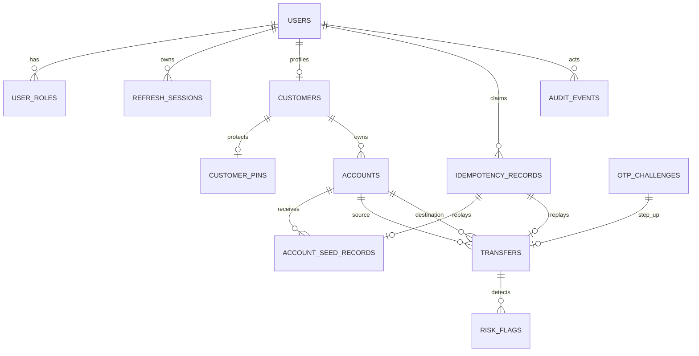

# Cloud Cloude Backend Database Architecture

## 1. Mục tiêu

Thiết kế PostgreSQL cho Digital Banking Simulator MVP:

- Customer registration, login, OTP, PIN, refresh session.
- Customer/account ownership và account status.
- Operator seed balance.
- Internal transfer với PIN/OTP, idempotency và transaction state.
- Append-only audit.
- AFTER_COMMIT risk flags.
- Stable cursor queries.

Hệ thống không xử lý tiền thật. Schema vẫn giữ invariant tiền, transaction atomicity và auditability để mô phỏng production-oriented backend.

## 2. Quyết định kiến trúc

### 2.1 Database

- Một PostgreSQL database cho modular monolith.
- Flyway quản lý forward-only migrations.
- Java UUID map PostgreSQL `UUID`.
- Timestamp map `TIMESTAMPTZ`.
- VND map `NUMERIC(19,0)`; không dùng `float`, `double` hoặc tiền dạng text trong DB.
- JSON metadata map `JSONB`.
- Không dùng JPA entity. JDBC repository là persistence adapter.
- Không reset database khi startup.

### 2.2 Module ownership

| Module | Bảng sở hữu | Trách nhiệm |
|---|---|---|
| identity | `users`, `user_roles`, `otp_challenges`, `refresh_sessions` | Credential, role, OTP, session |
| customer | `customers` | Customer profile |
| identity/customer | `customer_pins` | PIN credential; identity bảo vệ hash, customer UUID là ownership key |
| account | `accounts`, `account_seed_records` | Account lifecycle, balance, seed |
| transfer | `transfers` | Transfer state, money orchestration, history |
| audit | `audit_events` | Append-only audit facts và query |
| risk | `risk_flags` | AFTER_COMMIT detection và read-only query |
| shared | Không sở hữu business table | Cursor, error, correlation, idempotency technical API |
| shared.idempotency | `idempotency_records` | Request replay storage; không chứa business rule |

### 2.3 Foreign-key policy

Module boundary không dùng cross-module database foreign key. Các UUID liên module là scalar references được kiểm tra trong application transaction.

Physical foreign keys chỉ dùng cho quan hệ nội bộ identity:

- `user_roles.user_id -> users.id`.
- `refresh_sessions.user_id -> users.id`.
- `refresh_sessions.replaced_by_session_id -> refresh_sessions.id`.

Các quan hệ sau là logical references, không phải physical FK:

- `customers.user_id -> users.id`.
- `customer_pins.customer_id -> customers.id`.
- `accounts.customer_id -> customers.id`.
- `account_seed_records.account_id -> accounts.id`.
- `transfers.source_account_id -> accounts.id`.
- `transfers.destination_account_id -> accounts.id`.
- `transfers.otp_challenge_id -> otp_challenges.id`.
- `transfers.idempotency_record_id -> idempotency_records.id`.
- `risk_flags.transfer_id -> transfers.id`.
- `audit_events.actor_id` và target UUIDs.

Lý do: repository ownership và module API không bị thay thế bằng DB join/FK dependency. Application phải validate resource existence và ownership dưới lock khi mutation.

## 3. Logical ERD



`AUDIT_EVENTS.target_type` + `target_id` là polymorphic logical target. Không tạo FK tới mọi business table.

## 4. Bảng chi tiết

### 4.1 `users`

Identity login principal.

| Cột | Kiểu | Null | Quy tắc |
|---|---|---:|---|
| `id` | UUID | NO | PK |
| `phone` | VARCHAR(10) | NO | Unique; VN phone regex |
| `email_normalized` | VARCHAR(254) | NO | Lowercase, trimmed, unique |
| `password_hash` | VARCHAR(255) | NO | Hash only |
| `is_active` | BOOLEAN | NO | Default `TRUE` |
| `created_at` | TIMESTAMPTZ | NO | Default current timestamp |
| `updated_at` | TIMESTAMPTZ | NO | Mutation timestamp |

Indexes/constraints:

- PK `users_pkey`.
- Unique `uq_users_phone`.
- Unique `uq_users_email_normalized`.
- `phone` format `^0[3-9][0-9]{8}$`.
- `email_normalized = lower(btrim(email_normalized))`.
- Email non-empty.

### 4.2 `user_roles`

Many-to-many role assignment.

| Cột | Kiểu | Null | Quy tắc |
|---|---|---:|---|
| `user_id` | UUID | NO | PK part; FK `users` |
| `role` | VARCHAR(20) | NO | `CUSTOMER`, `OPERATOR`, `AUDITOR`, `ADMIN` |
| `created_at` | TIMESTAMPTZ | NO | Assignment timestamp |

PK: `(user_id, role)`.

Index: `(role, user_id)` cho role authorization lookup.

### 4.3 `customers`

Retail customer profile. Một user tối đa một customer profile.

| Cột | Kiểu | Null | Quy tắc |
|---|---|---:|---|
| `id` | UUID | NO | PK |
| `user_id` | UUID | NO | Logical one-to-one với `users`; unique |
| `full_name` | VARCHAR(120) | NO | Trim; length 1..120 |
| `address` | VARCHAR(300) | YES | Optional |
| `created_at` | TIMESTAMPTZ | NO | Default current timestamp |
| `updated_at` | TIMESTAMPTZ | NO | Mutation timestamp |

Index: `(created_at DESC, id DESC)`.

### 4.4 `customer_pins`

PIN credential và lockout state.

| Cột | Kiểu | Null | Quy tắc |
|---|---|---:|---|
| `customer_id` | UUID | NO | PK; logical customer reference |
| `pin_hash` | VARCHAR(255) | YES | Không lưu plaintext |
| `failed_attempts` | INTEGER | NO | 0..5; default 0 |
| `locked_until` | TIMESTAMPTZ | YES | PIN lock expiry |
| `configured_at` | TIMESTAMPTZ | YES | Required khi `pin_hash` tồn tại |
| `updated_at` | TIMESTAMPTZ | NO | Mutation timestamp |

Invariant:

- `pin_hash IS NULL` iff `configured_at IS NULL`.
- Failed attempts max 5.
- PIN lock update phải nằm trong transaction riêng để failed attempt không rollback theo request error.

### 4.5 `accounts`

Current balance và account lifecycle.

| Cột | Kiểu | Null | Quy tắc |
|---|---|---:|---|
| `id` | UUID | NO | PK |
| `account_number` | VARCHAR(12) | NO | Unique; 12 digits |
| `customer_id` | UUID | NO | Logical customer owner |
| `account_type` | VARCHAR(20) | NO | MVP `CHECKING` |
| `balance` | NUMERIC(19,0) | NO | Default 0; `>= 0` |
| `currency` | VARCHAR(3) | NO | MVP `VND` |
| `status` | VARCHAR(10) | NO | `ACTIVE`, `BLOCKED`, `CLOSED` |
| `is_default` | BOOLEAN | NO | Default TRUE |
| `opened_at` | TIMESTAMPTZ | NO | Open timestamp |
| `updated_at` | TIMESTAMPTZ | NO | Mutation timestamp |

Indexes/constraints:

- Unique account number.
- Partial unique index `(customer_id) WHERE is_default`.
- `(customer_id, opened_at DESC, id DESC)`.
- Balance non-negative.
- Account status enum check.
- Account type and currency checks.

MVP quyết định chỉ cần một default account/customer. Schema vẫn hỗ trợ nhiều account để không khóa upgrade path; application không tạo account thứ hai trong MVP.

### 4.6 `otp_challenges`

Generic OTP state cho registration, recovery, PIN reset, operator creation và transfer step-up.

| Cột | Kiểu | Null | Quy tắc |
|---|---|---:|---|
| `id` | UUID | NO | PK |
| `identifier_normalized` | VARCHAR(254) | NO | Phone/email normalized |
| `channel` | VARCHAR(10) | NO | `SMS`, `EMAIL` |
| `purpose` | VARCHAR(32) | NO | Approved purpose enum |
| `otp_hash` | VARCHAR(255) | NO | Hash only |
| `attempts` | INTEGER | NO | 0..5 |
| `max_attempts` | INTEGER | NO | Exactly 5 in MVP |
| `created_at` | TIMESTAMPTZ | NO | Issue time |
| `expires_at` | TIMESTAMPTZ | NO | Greater than created time |
| `consumed_at` | TIMESTAMPTZ | YES | Terminal timestamp |
| `invalidated_at` | TIMESTAMPTZ | YES | Terminal timestamp |

Invariant:

- Challenge cannot be consumed and invalidated simultaneously.
- Failed attempt update commits before returning `OTP_INVALID`.
- Expiry and fifth failure transition state before HTTP error response.

Indexes:

- `(identifier_normalized, purpose, channel, created_at DESC)`.
- Partial expiry index for active challenges.

### 4.7 `refresh_sessions`

Rotating refresh token sessions.

| Cột | Kiểu | Null | Quy tắc |
|---|---|---:|---|
| `id` | UUID | NO | PK |
| `user_id` | UUID | NO | FK `users` |
| `refresh_token_hash` | VARCHAR(64) | NO | Unique SHA-256 hex |
| `expires_at` | TIMESTAMPTZ | NO | Greater than created |
| `revoked_at` | TIMESTAMPTZ | YES | Revocation timestamp |
| `replaced_by_session_id` | UUID | YES | Self FK |
| `created_at` | TIMESTAMPTZ | NO | Issue timestamp |

Index: `(user_id, expires_at) WHERE revoked_at IS NULL`.

Rotation invariant:

- Refresh consumes/revokes current session and creates replacement in one transaction.
- Password recovery revokes all active sessions in same transaction as password update.

### 4.8 `idempotency_records`

Technical replay record scoped by actor, operation and key.

| Cột | Kiểu | Null | Quy tắc |
|---|---|---:|---|
| `id` | UUID | NO | PK |
| `actor_id` | UUID | NO | Scalar user ID |
| `operation` | VARCHAR(120) | NO | Operation scope |
| `idempotency_key` | VARCHAR(128) | NO | Length 16..128 |
| `request_hash` | CHAR(64) | NO | Canonical payload SHA-256 |
| `response_status` | SMALLINT | YES | 200..599; null means in progress |
| `response_body` | JSONB | YES | Original safe response |
| `resource_id` | UUID | YES | Transfer/seed resource |
| `created_at` | TIMESTAMPTZ | NO | Claim time |
| `expires_at` | TIMESTAMPTZ | NO | Retention >= 24h |

Unique key: `(actor_id, operation, idempotency_key)`.

Critical expiry rule:

- Current unique constraint blocks reuse after `expires_at` even though `find()` ignores expired rows.
- Before implementation acceptance, choose one design:
  1. Cleanup expired records before claim, inside controlled maintenance transaction.
  2. Add explicit claim lifecycle and reuse policy with forward migration.
  3. Keep expired keys permanently reserved and change `find()`/API semantics accordingly.
- Recommended MVP: cleanup only expired idempotency rows after retention; never delete business resources. Claim uses `INSERT ... ON CONFLICT`; race tests must cover active and expired records.

### 4.9 `account_seed_records`

Immutable operator demo-funding record.

| Cột | Kiểu | Null | Quy tắc |
|---|---|---:|---|
| `id` | UUID | NO | Seed transaction ID |
| `account_id` | UUID | NO | Logical account reference |
| `amount` | NUMERIC(19,0) | NO | 1..100,000,000 |
| `currency` | VARCHAR(3) | NO | `VND` |
| `actor_id` | UUID | NO | Operator user ID |
| `reference` | VARCHAR(100) | NO | Trim; length 1..100 |
| `idempotency_record_id` | UUID | NO | Unique replay link |
| `created_at` | TIMESTAMPTZ | NO | Seed time |

Index: `(account_id, created_at DESC, id DESC)`.

Atomic flow:

1. Lock account.
2. Validate operator, status, currency and amount.
3. Insert seed record.
4. Increment account balance.
5. Persist audit fact.
6. Complete idempotency record.

### 4.10 `transfers`

One row per internal transfer request and state machine.

| Cột | Kiểu | Null | Quy tắc |
|---|---|---:|---|
| `id` | UUID | NO | Transfer ID |
| `source_account_id` | UUID | NO | Logical account reference |
| `destination_account_id` | UUID | NO | Logical account reference |
| `amount` | NUMERIC(19,0) | NO | 2,000..10,000,000 |
| `currency` | VARCHAR(3) | NO | `VND` |
| `status` | VARCHAR(20) | NO | `AWAITING_OTP`, `COMPLETED`, `EXPIRED`, `FAILED` |
| `failure_code` | VARCHAR(80) | YES | Required for relevant failed state |
| `memo` | VARCHAR(140) | YES | Optional |
| `otp_challenge_id` | UUID | YES | Logical OTP reference |
| `idempotency_record_id` | UUID | YES | Unique replay link |
| `created_at` | TIMESTAMPTZ | NO | Request time |
| `expires_at` | TIMESTAMPTZ | YES | Required for `AWAITING_OTP` |
| `completed_at` | TIMESTAMPTZ | YES | Required only for `COMPLETED` |
| `updated_at` | TIMESTAMPTZ | NO | State mutation time |

Indexes:

- `(source_account_id, created_at DESC, id DESC)`.
- `(destination_account_id, created_at DESC, id DESC)`.
- Partial `(status, expires_at) WHERE status = 'AWAITING_OTP'`.
- `(created_at DESC, id DESC)`.
- `HIGH_FREQUENCY` lấy count source completed trong time window. Chưa thêm index riêng ở MVP: index `(source_account_id, created_at DESC, id DESC)` hỗ trợ lọc source; chỉ thêm index trên `completed_at` nếu `EXPLAIN ANALYZE` trên workload đại diện chứng minh cần.

State invariant:

```text
new request -> COMPLETED              (amount <= threshold)
new request -> AWAITING_OTP           (amount > threshold)
AWAITING_OTP -> COMPLETED             (valid OTP + revalidation)
AWAITING_OTP -> EXPIRED               (expiry)
AWAITING_OTP -> FAILED                (fifth OTP failure, insufficient funds, blocked account, dispatch failure)
COMPLETED / EXPIRED / FAILED -> final
```

Only `COMPLETED` changes balances. Source and destination account rows lock in deterministic UUID order before debit/credit.

Recommended forward constraints:

- Partial unique index `transfers(otp_challenge_id) WHERE otp_challenge_id IS NOT NULL`.
- Check `status = 'COMPLETED'` requires `completed_at IS NOT NULL`; every other status requires `completed_at IS NULL`.
- Check `status = 'AWAITING_OTP'` requires both `expires_at` and `otp_challenge_id`.
- Check `status <> 'AWAITING_OTP'` allows null expiry.

### 4.11 `audit_events`

Append-only security/business audit facts.

| Cột | Kiểu | Null | Quy tắc |
|---|---|---:|---|
| `id` | UUID | NO | Event ID |
| `actor_id` | UUID | YES | Anonymous/system action allowed |
| `actor_role` | VARCHAR(20) | YES | Approved role snapshot |
| `event_type` | VARCHAR(80) | NO | Allowlisted event name |
| `target_type` | VARCHAR(80) | NO | Allowlisted target type |
| `target_id` | UUID | NO | Target UUID |
| `outcome` | VARCHAR(10) | NO | `SUCCESS`, `FAILURE` |
| `correlation_id` | UUID | NO | Request correlation |
| `summary` | VARCHAR(500) | NO | No secret/PII |
| `metadata` | JSONB | NO | Safe allowlisted object; default `{}` |
| `occurred_at` | TIMESTAMPTZ | NO | Event time |

Indexes:

- `(occurred_at DESC, id DESC)`.
- `(event_type, occurred_at DESC, id DESC)`.
- `(actor_id, occurred_at DESC, id DESC)`.

Application exposes insert/read only. No update/delete endpoint. Database privilege hardening is deployment work, not migration-trigger logic.

### 4.12 `risk_flags`

Immutable read-only detection result.

| Cột | Kiểu | Null | Quy tắc |
|---|---|---:|---|
| `id` | UUID | NO | Flag ID |
| `transfer_id` | UUID | NO | Logical completed transfer reference |
| `rule_id` | VARCHAR(80) | NO | `LARGE_TRANSFER`, `HIGH_FREQUENCY` |
| `rule_version` | VARCHAR(40) | NO | Current version `1` |
| `reason` | VARCHAR(500) | NO | Safe explanation |
| `detected_at` | TIMESTAMPTZ | NO | Detection time |

Unique key: `(transfer_id, rule_id, rule_version)`.

Indexes:

- `(detected_at DESC, id DESC)`.
- `(rule_id, detected_at DESC, id DESC)`.
- `(transfer_id)`.

Rules:

- `LARGE_TRANSFER v1`: amount `> 5,000,000`; 5,000,000 does not flag.
- `HIGH_FREQUENCY v1`: source account has more than 5 `COMPLETED` transfers in rolling 10-minute window; incoming transfers do not count.
- Risk evaluation runs AFTER_COMMIT in `REQUIRES_NEW` transaction.
- Risk failure never changes transfer outcome.

## 5. Balance model decision

MVP keeps `accounts.balance` as current authoritative balance and stores immutable business records in `account_seed_records` and `transfers`.

This is sufficient for approved simulator scope because:

- Seed mutation has seed record.
- Transfer mutation has source, destination, amount and status.
- Only completed transfer mutates balance.
- Every mutation emits audit.

MVP does not yet have a double-entry ledger table. If project requires accounting-grade reconstruction, add future `account_ledger_entries` before calling schema production-grade:

- One credit/debit entry per completed transfer leg.
- One credit entry per seed.
- Immutable entries with unique operation/leg key.
- Balance rebuilt/checksummed against ledger.

Do not add ledger silently in current Phase 06. It changes scope and query semantics.

## 6. Migration sequence

| Version | Responsibility | Current status |
|---|---|---|
| V1 | users, roles, customers, PIN, accounts, audit | Existing |
| V2 | OTP, refresh sessions, idempotency | Existing |
| V3 | seed records, transfers | Existing |
| V4 | risk flags | Existing |
| V5 | Corrective constraints and indexes | Existing |
| V6 | Recovery reset tokens | Existing |
| V7 | Registration verification tokens | Existing |

Current migration baseline is V1–V7. V5 constraints/indexes are already applied. Do not treat following historical candidate list as pending work:

- Unique non-null transfer OTP challenge.
- Completed transfer frequency index.
- Stronger transfer state checks.
- Idempotency expiry/reuse policy.
- Any backward-compatible index needed after query plan inspection.

Never edit an already-applied migration. Add forward migration only.

## 7. Required DB acceptance tests

Testcontainers PostgreSQL must verify:

1. Flyway applies V1..V7 in order.
2. `information_schema` contains every expected table, column, type and nullability.
3. Unique constraints reject duplicate phone, email, account number and scoped idempotency key.
4. Account balance check rejects negative balance.
5. Transfer checks reject invalid amount, currency, status and invalid timestamps.
6. OTP checks enforce attempt and terminal-state invariants.
7. Seed transaction rolls back account balance when seed/audit/idempotency write fails.
8. Transfer debit/credit commits atomically and rolls back together.
9. Ordered account locks prevent deadlock for opposite transfer directions.
10. Same idempotency key concurrent requests produce one resource.
11. Audit append failure rolls back required business transaction.
12. Risk listener writes flags in separate transaction after transfer commit.
13. Risk write failure leaves committed transfer and balances unchanged.
14. Cursor queries use expected indexes and stable timestamp/UUID tie-break.
15. Risk uniqueness prevents duplicate flags on repeated evaluation.

## 9. Rà soát schema MVP

### 9.1 Bảng cần giữ

| Bảng | Kết luận | Vai trò MVP |
|---|---|---|
| `users` | Giữ | Login identity, password hash, active state |
| `user_roles` | Giữ | Multi-role assignment |
| `customers` | Giữ | Retail profile và ownership root |
| `customer_pins` | Giữ | PIN hash và lockout state riêng password |
| `accounts` | Giữ | Current balance và lifecycle |
| `otp_challenges` | Giữ | OTP registration/recovery/PIN/transfer |
| `refresh_sessions` | Giữ | Refresh rotation, revoke, logout all |
| `idempotency_records` | Giữ | Seed/transfer retries |
| `account_seed_records` | Giữ | Immutable demo seed record |
| `transfers` | Giữ | State machine, transfer history và money mutation reference |
| `audit_events` | Giữ | Audit trail |
| `risk_flags` | Giữ | Read-only risk detection |

Không bảng nào trong 12 bảng này chỉ dành cho tương lai. Không thêm ledger, beneficiary, KYC, notification delivery, risk review hoặc settlement tables trong MVP.

### 9.2 Cột cần giữ

Giữ toàn bộ cột đang phục vụ trực tiếp API, security, business invariant hoặc replay:

- UUID primary keys và ownership/resource UUIDs.
- `users.phone`, `email_normalized`, `password_hash`, `is_active`.
- `user_roles.role`.
- `customers.full_name`, `address` vì API hiện nhận/trả customer profile.
- PIN hash, failed attempt, lock timestamps.
- Account number, owner, account type, balance, currency, status, default flag.
- OTP identifier/channel/purpose/hash/attempts/max attempts/expiry/consume/invalidate timestamps.
- Refresh token hash, expiry, revoke time, replacement session link.
- Idempotency actor/scope/key/hash/original response/resource/retention timestamps.
- Seed actor/amount/currency/reference/idempotency/time.
- Transfer source/destination/amount/currency/status/failure/memo/OTP/idempotency/create/expiry/complete/update fields.
- Audit actor/action/target/outcome/correlation/summary/safe metadata/time.
- Risk transfer/rule/version/reason/detection time.

### 9.3 Không thêm cột ngoài MVP

Không thêm PII/KYC, branch/bank data, available/held balance, debit/credit aggregates, provider delivery metadata, reviewed state, soft delete, optimistic version hoặc generic JSON metadata trên business rows. Chưa có consumer hoặc acceptance criteria.

### 9.4 Cột hiện hữu có vẻ dư nhưng vẫn giữ

| Cột | Vì sao giữ |
|---|---|
| `accounts.account_type` | API trả `accountType`; MVP check constraint chỉ cho `CHECKING` |
| `accounts.is_default` | Onboarding có default-account concept; partial unique index bảo vệ một default/customer |
| `users.is_active` | Cần disable login principal |
| `transfers.failure_code`, `memo` | API/history contract expose hai trường |
| `audit_events.metadata` | Audit policy cần safe allowlisted details; endpoint không trả metadata |
| `idempotency_records.response_body`, `resource_id` | Replay trả kết quả gốc, không rebuild từ balance thay đổi |
| `otp_challenges.max_attempts` | Lưu policy snapshot; MVP constraint cố định giá trị 5 |
| `refresh_sessions.replaced_by_session_id` | Liên kết refresh rotation và hỗ trợ security investigation |
| `updated_at` | Có consumer update hoặc cần state diagnostics; không bỏ chỉ để giảm cột ít storage |

### 9.5 Quan hệ

ERD ở mục 3 giữ nguyên. User-role, refresh-session và replacement-session có physical FK. Quan hệ business xuyên module dùng scalar UUID, application kiểm tra trong transaction. Không thêm FK chéo module.

### 9.6 Balance model

Không thêm `account_ledger_entries` trong MVP. Current balance + seed record + transfer record + audit đáp ứng simulator scope. Double-entry/rebuild/reconciliation/rollback ledger là future requirement, không phải thiếu sót của MVP.

## 10. Schema constraints cần có

V5 đã triển khai các constraint/index cần thiết cho MVP. Không còn trạng thái “candidate” hoặc “pending” trong migration baseline:

- `AWAITING_OTP` bắt buộc có `expires_at` và `otp_challenge_id`.
- `expires_at` chỉ được set khi `AWAITING_OTP`.
- `COMPLETED` iff `completed_at IS NOT NULL`.
- Partial unique index trên non-null `otp_challenge_id`.

Index frequency riêng trên `completed_at` chưa được thêm. Trước hết dùng index source/created hiện có, đo bằng `EXPLAIN ANALYZE`, thêm index chỉ khi query plan/workload cần. Không giữ index dư chỉ dựa trên dự đoán.

## 11. Idempotency retention decision

Unique `(actor_id, operation, idempotency_key)` keeps an expired record reserved until controlled cleanup. Current MVP does not silently reuse expired keys. This preserves replay safety and avoids deleting an idempotency record while its related business result may still need reconciliation.

Cleanup of expired idempotency rows is a future controlled maintenance operation. It must never delete seed or transfer business records. Any change to expired-key reuse requires a new forward migration and PostgreSQL race tests.


## 12. Database acceptance tests

1. Flyway apply đúng V1..V7; tất cả migration hiện hữu đã được kiểm tra qua Testcontainers PostgreSQL theo evidence mới nhất.
2. Verify tables, columns, PostgreSQL types, nullability và constraints qua metadata.
3. Unique phone/email/account number/scoped idempotency.
4. Non-negative balance, supported currency/status, valid state timestamps.
5. Seed/audit/idempotency failure rollback cùng transaction.
6. Transfer debit/credit atomic, opposite-direction ordered locking.
7. Concurrent same-key transfer/seed tạo đúng một business resource.
8. Active idempotency replay và expired-key behavior.
9. Audit query append-only/redaction/filter/cursor.
10. Risk unique flag, AFTER_COMMIT, independent transaction, risk failure không rollback transfer.
11. History visibility/filter/page ties và cursor query.

## 13. Kết luận

Schema đã review theo MVP scope: 12 bảng đều có consumer; chưa thấy bảng business thừa cần bỏ. Chưa thêm tương lai hóa. Đã loại bỏ index risk frequency dự đoán khỏi đề xuất; cần đo query trước.

Acceptance còn pending:

- Chạy bổ sung concurrency, rollback, restart/retry và DB outage acceptance theo [09-acceptance-gap-and-team-plan.md](./09-acceptance-gap-and-team-plan.md).
- Chạy k6 load test và ghi p50/p95/p99, error rate, resource usage và financial invariants.
- Security scan, CI evidence và cloud deployment vẫn chưa thuộc migration baseline.

### 8.1 Bảng bắt buộc giữ

| Bảng | Kết luận | Lý do |
|---|---|---|
| `users` | Giữ | Login identity, password, active state |
| `user_roles` | Giữ | Một user có thể có nhiều role; thay cho single role column |
| `customers` | Giữ | Customer profile và ownership root |
| `customer_pins` | Giữ | PIN hash và lockout độc lập password |
| `accounts` | Giữ | Balance, status, account ownership |
| `otp_challenges` | Giữ | Dùng chung registration/recovery/PIN/transfer OTP |
| `refresh_sessions` | Giữ | Rotating refresh cookie và revoke all sessions |
| `idempotency_records` | Giữ | Retry safety cho seed/transfer |
| `account_seed_records` | Giữ | Immutable demo-funding record và replay resource |
| `transfers` | Giữ | Transfer state, history, money mutation reference |
| `audit_events` | Giữ | Audit trail bắt buộc |
| `risk_flags` | Giữ | Risk detection bắt buộc trong MVP |

### 8.2 Cột bắt buộc giữ

- PK UUID trên mọi bảng.
- Ownership IDs: `customers.user_id`, `accounts.customer_id`, transfer source/destination IDs.
- Money fields: `balance`, seed/transfer `amount`, `currency`.
- Lifecycle fields: status, created/updated timestamps, transfer expiry/completion.
- Security fields: password/PIN/OTP hashes, attempts, lock/revoke/consume timestamps.
- Replay fields: idempotency scope, request hash, response status/body/resource ID.
- Audit fields: actor, action, target, outcome, correlation, summary, occurred time.
- Risk fields: transfer, rule ID/version, reason, detection time.

### 8.3 Cột không thêm trong MVP

Không thêm các cột sau vì chưa có use case/endpoint/acceptance test:

- `first_name`, `last_name`, `date_of_birth`, `gender`, `national_id`, `kyc_status`.
- `account_name`, `branch_code`, `bank_code`, `interest_rate`, `available_balance`.
- `debit_total`, `credit_total`, `hold_amount`, `settlement_status`.
- `otp_delivery_status`, `provider_message_id`, `sms_cost`.
- `risk_status`, `reviewed_by`, `reviewed_at`, `review_notes`.
- `deleted_at`, soft-delete flags cho bảng immutable.
- Generic `version` columns; row locks và PostgreSQL transactions đủ cho MVP.
- `metadata` trên business tables; chỉ audit cần JSONB safe metadata.

### 8.4 Cột cần bỏ hoặc giữ có điều kiện

- `customers.address`: giữ vì OpenAPI registration/counter request có address; không dùng trong transfer response.
- `accounts.account_type`: giữ vì OpenAPI Account trả `accountType`, dù MVP chỉ cho `CHECKING`; giữ constraint enum để không tạo fake flexibility.
- `accounts.is_default`: giữ vì onboarding tạo default account và response cần biểu đạt default account; partial unique index bảo vệ invariant.
- `users.is_active`: giữ vì login/account security cần disable principal.
- `transfers.failure_code`: giữ vì OpenAPI history/status cần lý do failure.
- `transfers.memo`: giữ vì transfer request/response có memo.
- `audit_events.metadata`: giữ nhưng chỉ allowlist metadata; API không trả field này.
- `idempotency_records.response_body`: giữ vì replay phải trả original response, không rebuild từ mutable balance.
- `idempotency_records.resource_id`: giữ vì seed/transfer replay cần resource lookup.
- `otp_challenges.max_attempts`: giữ vì record cần snapshot policy; check MVP bắt buộc giá trị 5.
- `refresh_sessions.replaced_by_session_id`: giữ vì rotation chain và replay/reuse investigation; chưa dùng trong mọi query nhưng có giá trị security audit.

### 8.5 Quan hệ cần giữ và quan hệ không cần FK

Giữ quan hệ nghiệp vụ:

```text
users -> roles
users -> customer profile
customer -> PIN
customer -> accounts
account -> seed records
account -> transfer source/destination
transfer -> OTP challenge
transfer -> idempotency record
transfer -> risk flags
user -> audit actor
```

Không thêm physical cross-module FK trong MVP. Application services phải validate logical references trong cùng transaction. Đây là deliberate modular-monolith boundary, không phải thiếu sót.

### 8.6 Ledger decision

Không thêm `account_ledger_entries` trong MVP. Current scope cần current balance + immutable seed/transfer records, không cần accounting reconstruction.

Ledger chỉ thêm khi có requirement:

- Rebuild balance từ immutable entries.
- Double-entry debit/credit.
- Reconciliation.
- Reversal/chargeback.
- External settlement.

Đây là future extension, không nằm trong schema MVP.

## 9. Điều chỉnh schema sau rà soát

Đã cập nhật transfer DDL với các invariant/index thật sự cần cho MVP:

- `AWAITING_OTP` bắt buộc có `otp_challenge_id`.
- Chỉ `AWAITING_OTP` được có `expires_at`.
- Thêm unique partial index trên `otp_challenge_id`.
- Thêm partial index cho frequency rule theo `(source_account_id, completed_at DESC, id DESC)`.

Các thay đổi nằm trong [V3__seed_ledger_and_transfers.sql](../../../be/src/main/resources/db/migration/V3__seed_ledger_and_transfers.sql). Nếu V3 đã chạy ở môi trường nào, không sửa trực tiếp migration đó ở môi trường đã apply; khi chuẩn bị DB acceptance phải chuyển các thay đổi này thành forward migration V5.

## 10. Kết luận sau rà soát

Schema MVP hiện giữ đúng 12 bảng cần thiết. Không bảng nào là speculative. Không thêm ledger, beneficiary, notification delivery, KYC, review workflow hoặc settlement tables.
Còn ba việc DB bắt buộc trước acceptance:

1. Chọn policy idempotency expired key và triển khai bằng forward migration.
2. Chuyển các constraint/index điều chỉnh từ V3 sang V5 nếu V3 đã được apply.
3. Chạy PostgreSQL/Testcontainers để xác minh DDL, constraints, index/query và transaction invariants.

